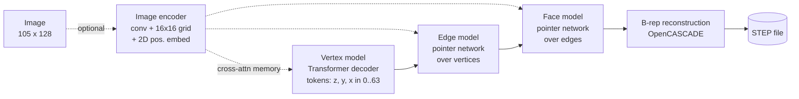

# Autoregressive B-rep generation

A PyTorch reimplementation of **SolidGen** (Jayaraman et al., TMLR 2022) for generating CAD solids directly as boundary representations, plus a reconstruction engine that turns the model's output back into real geometry. Three Transformers generate a shape in stages: vertices as quantised coordinates, then edges as pointers into the vertex set, then faces as pointers into the edge set. Hand-written validity masks constrain sampling at every step, and the resulting indexed B-rep is assembled in OpenCASCADE, checked, and written out as a STEP file that any CAD package can open.

Built during a research internship at Arizona State University (2025), trained on models from the [DeepCAD](https://github.com/ChrisWu1997/DeepCAD) dataset.

## How it works



The model factorises a solid as p(B) = p(V) · p(E | V) · p(F | E, V).

**Vertex model.** Vertices are quantised to a 64-level grid inside the bounding box, sorted lexicographically by (z, y, x), and flattened into one token sequence with SOS and EOS. A causal Transformer decoder predicts each coordinate token given the previous ones, with separate embeddings for the token value, its coordinate axis, and its position.

**Edge model.** Each vertex is embedded through per-axis lookups and a linear projection, encoded by a Transformer encoder, and placed in a fixed-size memory of 150 slots plus three learned special tokens (NEW_EDGE, EOS, SOS). The decoder's output is dotted against that memory, so every logit is a pointer to a vertex or a special token rather than a vocabulary entry. Edges with three vertices are circular arcs; two are lines.

**Face model.** Same pointer construction one level up: edge embeddings are the mean of their encoded endpoint embeddings, padded to 150 slots, and faces are generated as sequences of edge pointers separated by NEW_FACE.

Fixing the memory size at 150 (rather than the per-sample vertex count) is what lets the special tokens keep the same index across every sample in a batch. Both models mask out slots beyond the real vertex or edge count.

**Constrained sampling.** `generate.py` uses nucleus sampling (p = 0.9) under a mask rebuilt at every step:

| Stage | Rules |
| --- | --- |
| Vertices | no SOS after position 0; each coordinate must respect the (z, y, x) sort order of the sequence so far; EOS only on a full triple |
| Edges | only existing vertices; no consecutive special tokens; 2 or 3 vertices per edge; vertices within an edge in ascending order; no repeated vertex in an edge |
| Faces | only existing edges; at least 2 edges per face; each edge used at most twice across all faces (a manifold condition); edges within a face in ascending order |

**Reconstruction.** `indexed_to_brep()` dequantises the vertices, builds each edge as a line or a circle fitted through three points, classifies each face's surface as planar, cylindrical, or spherical from its edges, trims a face from each closed wire, sews the faces, and validates the result with `BRepCheck_Analyzer` before writing STEP.

**Training.** The three models are trained jointly with the sum of their token cross-entropies (label smoothing 0.1, padding masked), AdamW at 1e-4, gradient clipping at 1.0, checkpointing and TensorBoard logging. Architecture: `d_model` 256, 8 heads, 8 layers per model, pre-LayerNorm, GELU, dropout 0.2; 6.5M, 10.7M and 14.9M parameters for the vertex, edge and face models.

## What is and isn't here

The code implements both the unconditional model and the image-conditioned variant (`ImageEncoder`, `SolidGenDataset`, `generate_from_image`). The entry points as committed train and sample the **unconditional** model; the image-conditioned path is a few uncommented lines away in `main_train.py` and `generate.py`.

`logs/generation_sample.txt` is a verbose trace of one sampling run at an intermediate checkpoint. It is worth reading for what it shows: the three stages produce syntactically valid token sequences, and the reconstruction engine gets as far as building wires, but at that checkpoint the sampled faces do not close into valid trimmed surfaces and `BRepCheck` rejects the sewn shape. Turning a topologically plausible token sequence into a watertight solid is the hard part of this problem, and the log is an honest picture of where this implementation stood.

The curation script that produced the training files from DeepCAD, and the trained checkpoints, lived on the ASU cluster and were not preserved. `data/README.md` documents the input format and includes one real sample so the pipeline can be fed from any source that emits it.

## Run it

```sh
pip install -r requirements.txt
conda install -c conda-forge pythonocc-core     # OpenCASCADE bindings, needed by generate.py

python main_train.py --data_root ./data --output_dir ./training_output --epochs 200 --batch_size 128
python generate.py --checkpoint_path training_output/<run>/best.pth.tar --num_samples 10 --output_dir ./generated_output
```

`main_train.py --help` lists the rest. Training expects the layout described in `data/README.md`.

## Files

| File | What it holds |
| --- | --- |
| `models.py` | `ImageEncoder`, `VertexModel`, `EdgeModel`, `FaceModel`, token constants |
| `main_train.py` | tokenisation (`tokenize_vertices` / `_edges` / `_faces`), datasets, joint training and evaluation loops, checkpointing |
| `generate.py` | masked nucleus sampling, the three per-stage mask builders, `indexed_to_brep` and STEP export |
| `data/README.md` | input schema and one sample |
| `logs/generation_sample.txt` | trace of a sampling run |

## Reference

Jayaraman, Lambourne, Willis, Sanghi, Davies, Morris. *SolidGen: An Autoregressive Model for Direct B-rep Synthesis.* TMLR 2022. Vertex ordering, the pointer-network formulation, and the sampling constraints follow Appendix A of that paper.

## Author

Arnav Agarwal, IIT Bombay. [arnavagarwal05.github.io](https://arnavagarwal05.github.io)
